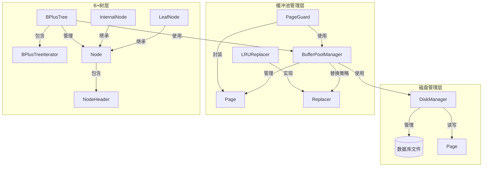
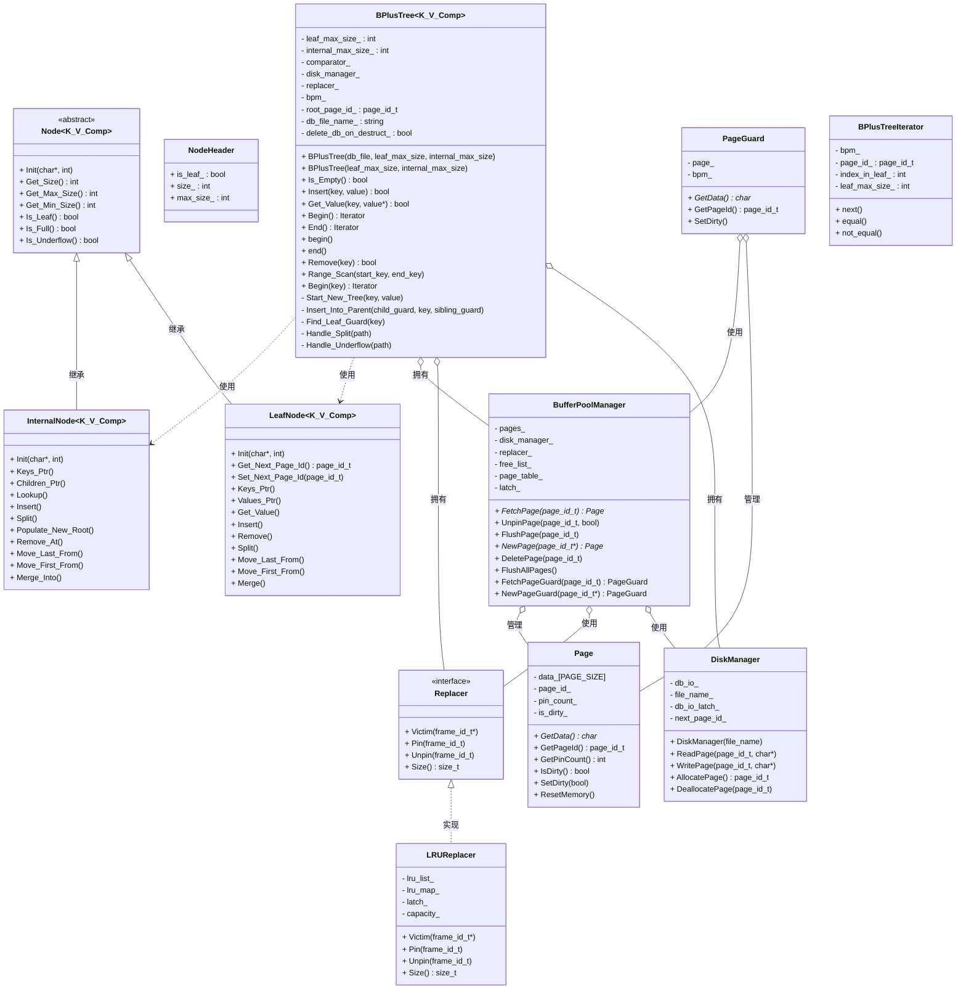
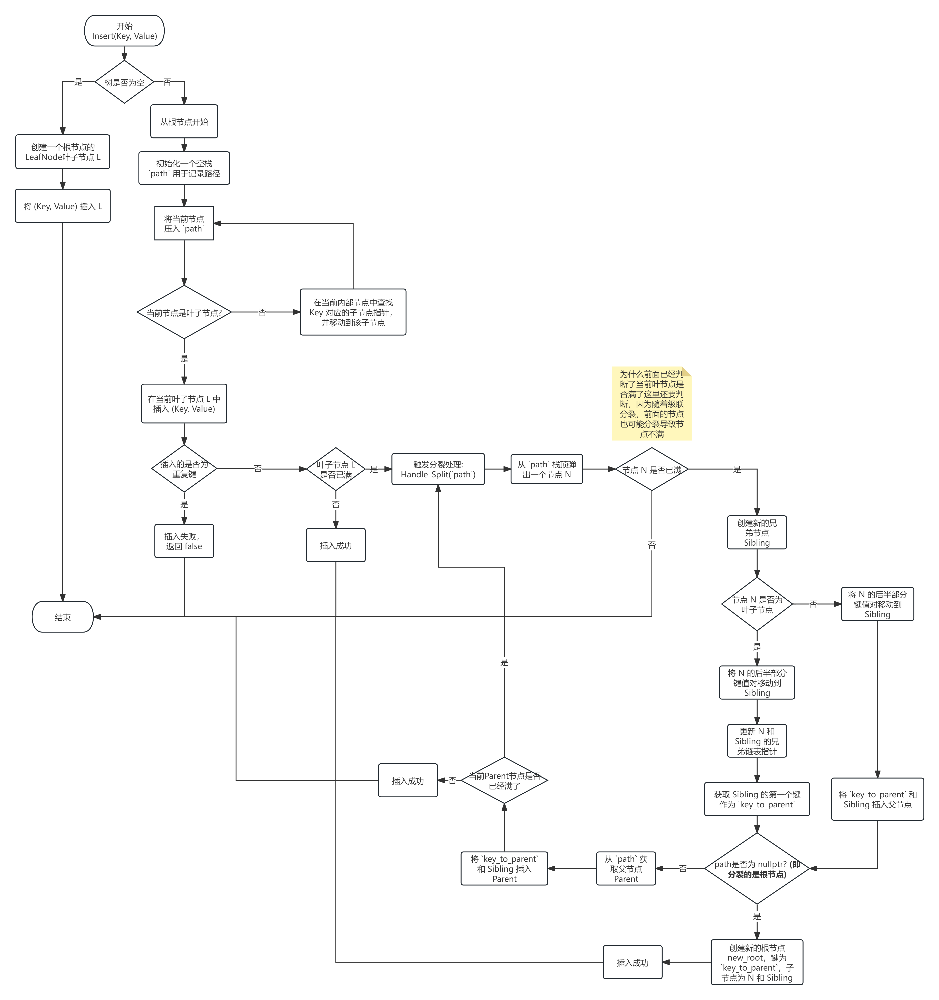
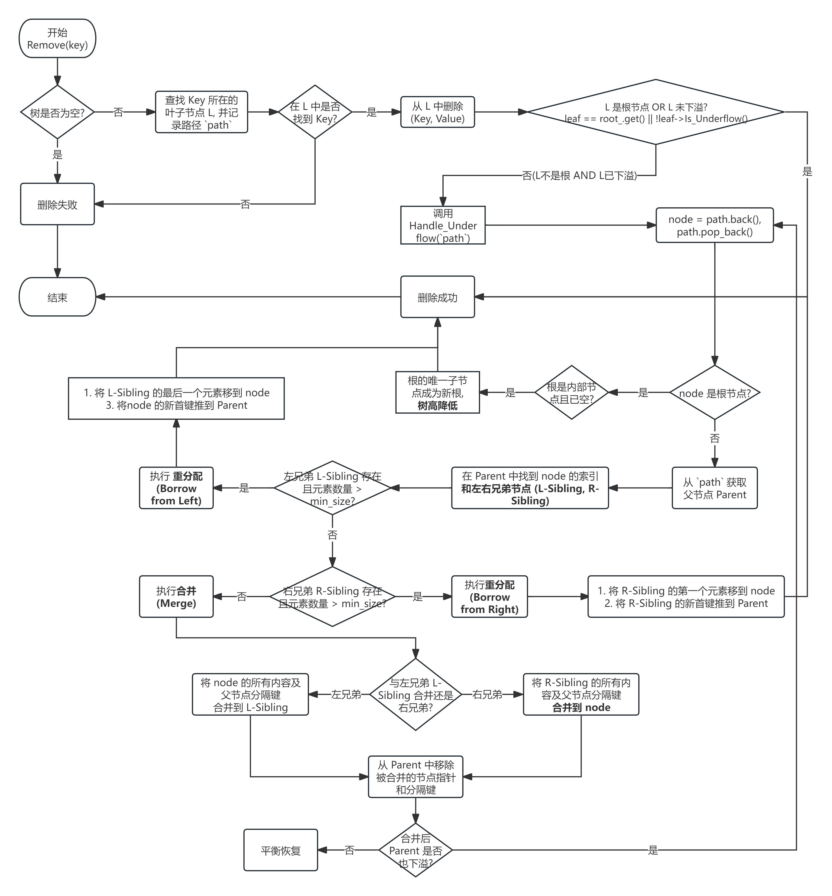
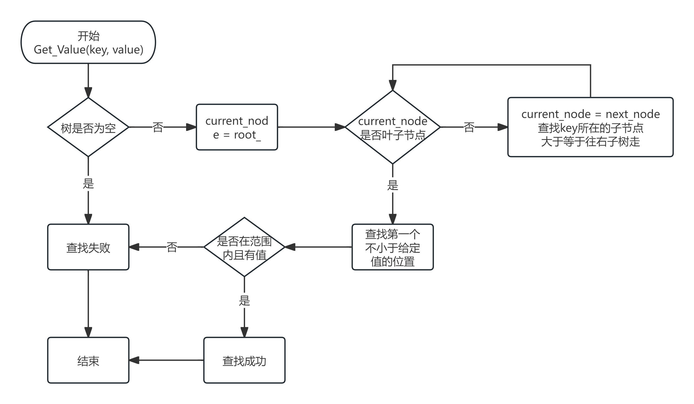
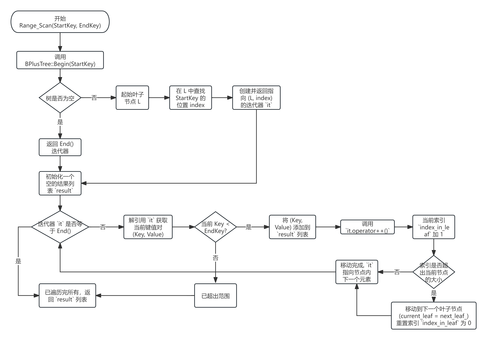

# B+树并发数据库系统实验报告

## 1. 程序目标功能的理解

### 1.1 项目概述
本项目实现了一个支持并发操作的B+树数据库系统，主要目标包括：

- **B+树数据结构实现**: 实现完整的B+树索引结构，支持高效的插入、删除、查找和范围查询操作
- **并发控制机制**: 通过读写锁机制支持多线程并发访问，确保数据一致性
- **持久化存储**: 实现数据在内存和磁盘之间的自动管理，支持数据持久化
- **缓冲池管理**: 实现LRU页面替换策略，优化磁盘I/O性能

### 1.2 核心功能特性

#### 1.2.1 基本操作
- **插入操作**: 支持单键值对的插入，自动处理节点分裂
- **删除操作**: 支持单键值对的删除，自动处理节点合并
- **查找操作**: 支持精确查找和范围查找
- **迭代器**: 提供STL兼容的迭代器接口

#### 1.2.2 并发特性
- **读写分离**: 读操作可以并发执行，写操作串行执行
- **全局锁机制**: 使用`std::shared_mutex`实现读写锁
- **事务支持**: 预留事务接口，支持未来的事务功能扩展

#### 1.2.3 存储管理
- **页面管理**: 基于页面的存储模型，支持大容量数据
- **缓冲池**: LRU页面替换策略，减少磁盘访问
- **序列化**: 支持数据在内存和磁盘之间的序列化/反序列化

## 2. 架构图

### 2.1 系统整体架构





### 2.2 并发操作架构（两轮闩蟹与路径锁定）

```mermaid
graph TD
    A[std::shared_mutex root_latch_] --> B[第一轮: 自顶向下定位]
    A --> C[第二轮: 自顶向下写闩蟹]
    B --> D[内部节点RLatch, 叶子WLatch(仅写操作)]
    D --> E[不安全则重启第二轮]
    C --> F[路径上各页WLatch并记录于Transaction]
```

## 3. 重要数据结构

### 3.1 B+树节点结构

#### 3.1.1 节点基类 (Node)
```cpp
template<typename KeyT, typename ValueT, typename KeyComparator>
class Node {
protected:
    NodeHeader header_;  // 节点头部信息
    char data_[PAGE_SIZE - sizeof(NodeHeader)];  // 节点数据区域
};
```

#### 3.1.2 叶子节点 (LeafNode)
```cpp
template<typename KeyT, typename ValueT, typename KeyComparator>
class LeafNode : public Node<KeyT, ValueT, KeyComparator> {
private:
    page_id_t next_page_id_;  // 下一个叶子节点指针
    KeyT keys_[LEAF_MAX_SIZE];  // 键数组
    ValueT values_[LEAF_MAX_SIZE];  // 值数组
};
```

#### 3.1.3 内部节点 (InternalNode)
```cpp
template<typename KeyT, typename ValueT, typename KeyComparator>
class InternalNode : public Node<KeyT, ValueT, KeyComparator> {
private:
    KeyT keys_[INTERNAL_MAX_SIZE];  // 键数组
    page_id_t children_[INTERNAL_MAX_SIZE + 1];  // 子节点指针数组
};
```

### 3.2 页面管理结构

#### 3.2.1 页面结构 (Page)
```cpp
class Page {
private:
    char data_[PAGE_SIZE];  // 页面数据
    page_id_t page_id_;     // 页面ID
    int pin_count_;         // 引用计数
    bool is_dirty_;         // 脏页标记
};
```

#### 3.2.2 页面守卫 (PageGuard)
```cpp
class PageGuard {
private:
    Page *page_;                    // 页面指针
    BufferPoolManager *bpm_;        // 缓冲池管理器
};
```

### 3.3 缓冲池管理结构

#### 3.3.1 缓冲池管理器 (BufferPoolManager)
```cpp
class BufferPoolManager {
private:
    std::vector<Page *> pages_;           // 页面数组
    DiskManager *disk_manager_;           // 磁盘管理器
    Replacer *replacer_;                  // 页面替换器
    std::list<frame_id_t> free_list_;     // 空闲帧列表
    std::unordered_map<page_id_t, frame_id_t> page_table_;  // 页面映射表
    std::mutex latch_;                    // 互斥锁
};
```

#### 3.3.2 LRU替换器 (LRUReplacer)
```cpp
class LRUReplacer {
private:
    std::list<frame_id_t> lru_list_;      // LRU链表
    std::unordered_map<frame_id_t, std::list<frame_id_t>::iterator> lru_map_;  // 映射表
    std::mutex latch_;                    // 互斥锁
    size_t capacity_;                     // 容量
};
```

## 4. 程序运行截图

### 4.1 基本操作流程图

#### 4.1.1 插入操作流程


#### 4.1.2 删除操作流程


#### 4.1.3 查找操作流程


#### 4.1.4 范围查找流程


### 4.2 并发操作流程

#### 4.2.1 并发插入流程
详细流程请参考：[doc/并发插入流程图.md](doc/并发插入流程图.md)

#### 4.2.2 并发删除流程
详细流程请参考：[doc/并发删除流程图.md](doc/并发删除流程图.md)

#### 4.2.3 并发搜索流程
详细流程请参考：[doc/并发搜索流程图.md](doc/并发搜索流程图.md)

## 5. 遇到的问题及其解决方法

### 5.1 并发控制问题

#### 5.1.1 问题描述
在实现多线程并发访问时，遇到了数据竞争和一致性问题。多个线程同时访问B+树可能导致数据结构损坏。

#### 5.1.2 解决方案
- **两轮闩蟹**: 第一轮读路径/叶写，第二轮全路径写，必要时重启确保安全
- **路径锁定与回溯更新**: 第二轮记录路径，支持父节点连锁分裂/合并的安全更新
- **原子操作**: 关键修改在持有路径写锁期间完成

```cpp
// 读操作使用共享锁
std::shared_lock<std::shared_mutex> read_lock(root_latch_);

// 写操作使用独占锁
std::lock_guard<std::shared_mutex> write_lock(root_latch_);
```

### 5.2 内存与Pin管理问题

#### 5.2.1 问题描述
页面在内存中的生命周期管理复杂，容易出现内存泄漏或访问已释放内存的问题。

#### 5.2.2 解决方案
- **RAII/纪律**: 对显式Fetch的页面严格在解锁后Unpin；Get_Value路径已补充Unpin
- **引用计数**: 通过`pin_count`跟踪页面使用情况
- **自动释放**: Guard场景自动释放

```cpp
class PageGuard {
public:
    ~PageGuard() {
        if (page_ != nullptr && bpm_ != nullptr) {
            bpm_->UnpinPage(page_->GetPageId(), is_dirty_);
        }
    }
};
```

### 5.3 磁盘I/O优化问题

#### 5.3.1 问题描述
频繁的磁盘访问严重影响系统性能，需要优化I/O操作。

#### 5.3.2 解决方案
- **缓冲池机制**: 实现页面缓存，减少磁盘访问
- **LRU替换策略**: 优先淘汰最近最少使用的页面
- **批量操作**: 支持批量读写操作

```cpp
class LRUReplacer {
public:
    auto Victim(frame_id_t *frame_id) -> bool {
        std::lock_guard<std::mutex> lock(latch_);
        if (lru_list_.empty()) return false;
        *frame_id = lru_list_.back();
        lru_list_.pop_back();
        lru_map_.erase(*frame_id);
        return true;
    }
};
```

### 5.4 序列化问题

#### 5.4.1 问题描述
数据在内存和磁盘之间传输时需要序列化/反序列化，需要考虑字节序和内存对齐问题。

#### 5.4.2 解决方案
- **字节序处理**: 统一使用小端字节序
- **内存对齐**: 确保数据结构的内存对齐
- **版本控制**: 为序列化格式添加版本号

详细序列化机制请参考：[doc/序列化.md](doc/序列化.md) 和 [doc/反序列化.md](doc/反序列化.md)

### 5.5 并发性能优化问题

#### 5.5.1 问题描述
在高并发场景下，全局锁成为性能瓶颈，需要优化并发性能。

#### 5.5.2 解决方案
- **两轮协议**: 缩短不必要的写锁持有时间
- **锁粒度优化**: 后续可演进为节点级闩蟹
- **批量操作**: 支持批量插入和删除

当前实现的并发性能分析请参考：[doc/并发操作总览.md](doc/并发操作总览.md)

## 6. 总结与展望

### 6.1 项目成果
1. **完整的B+树实现**: 支持所有基本操作和高级功能
2. **并发安全**: 通过读写锁机制保证数据一致性
3. **高性能**: 通过缓冲池和LRU策略优化I/O性能
4. **可扩展性**: 预留事务接口，支持未来功能扩展

### 6.2 技术亮点
1. **RAII资源管理**: 使用智能指针和守卫模式
2. **模板化设计**: 支持任意键值类型
3. **STL兼容**: 提供标准迭代器接口
4. **并发控制**: 实现读写锁机制

### 6.3 未来改进方向
1. **细粒度锁**: 实现节点级锁提高并发性能
2. **事务支持**: 完善事务功能
3. **索引优化**: 支持复合索引和部分索引
4. **压缩存储**: 实现数据压缩减少存储空间

## 7. 参考资料

- [类图设计](doc/类图.md)
- [并发操作总览](doc/并发操作总览.md)
- [序列化机制](doc/序列化.md)
- [反序列化机制](doc/反序列化.md)
- [并发插入流程](doc/并发插入流程图.md)
- [并发删除流程](doc/并发删除流程图.md)
- [并发搜索流程](doc/并发搜索流程图.md)

