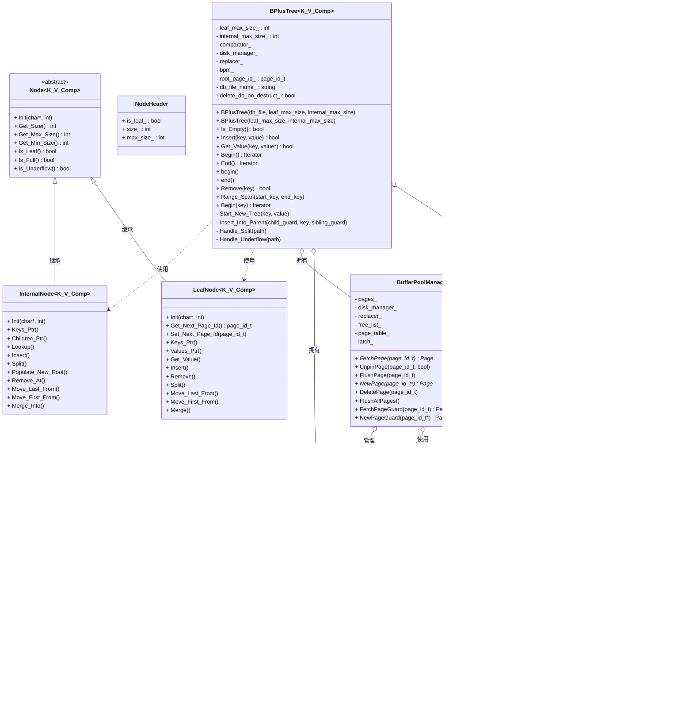

# B+树并发数据库系统实验报告

## 目录

- [快速开始](#快速开始)
- [示例（最小用法）](#示例最小用法)
- [构建与测试说明](#构建与测试说明)
- [配置项与调优建议](#配置项与调优建议)
- [并发保证（摘要）](#并发保证摘要)
- [常见问题排查（Troubleshooting）](#常见问题排查troubleshooting)
- [许可证与贡献](#许可证与贡献)
- [1. 程序目标功能的理解](#1-程序目标功能的理解)
- [2. 架构图](#2-架构图)
- [3. 重要数据结构](#3-重要数据结构)
- [4. 程序运行截图](#4-程序运行截图)
- [5. 遇到的问题及其解决方法](#5-遇到的问题及其解决方法)
- [6. 总结与展望](#6-总结与展望)
- [7. 参考资料](#7-参考资料)
- [8. TODO（未来改进）](#8-todo未来改进)

## 快速开始

### Linux

```bash
# 在项目根目录下
mkdir -p cmake-build-debug
/usr/bin/cmake -DCMAKE_BUILD_TYPE=Debug -G "Unix Makefiles" -S . -B cmake-build-debug
cmake --build cmake-build-debug -j

# 运行测试（当前工程结构下，测试编进了 bptree 可执行）
./cmake-build-debug/bptree
```

可选的 Release 构建：

```bash
mkdir -p cmake-build-release
/usr/bin/cmake -DCMAKE_BUILD_TYPE=Release -G "Unix Makefiles" -S . -B cmake-build-release
cmake --build cmake-build-release -j
./cmake-build-release/bptree
```

## 示例（最小用法）

```cpp
#include "b_plus_tree.h"

int main() {
    BPlusTree<int, int, std::less<int>> tree("test.bp", /*leaf_max*/128, /*internal_max*/256);
    tree.Insert(1, 100);
    int out = 0;
    if (tree.Get_Value(1, &out)) {
        // 使用查询结果
    }
    for (auto it = tree.Begin(); it != tree.End(); ++it) {
        // 遍历所有键值对
    }
}
```

## 构建与测试说明

- 当前结构会将 `test/*.cpp` 与 `src/bptree/main.cpp` 一并编译为可执行程序 `bptree`，其中 `main.cpp` 启动 GoogleTest：

```bash
# 运行所有测试
./cmake-build-debug/bptree

# 常用 GoogleTest 参数
./cmake-build-debug/bptree --gtest_list_tests
./cmake-build-debug/bptree --gtest_filter=SuiteName.TestName
./cmake-build-debug/bptree --gtest_filter=SuiteName.*
./cmake-build-debug/bptree --gtest_repeat=10 --gtest_break_on_failure
```

- 推荐的后续改进（可在将来采纳）：将核心代码做成库目标（如 `bptree_core`），测试单独生成 `bptree_tests` 并启用 `ctest`，这样可用：

```bash
ctest --test-dir cmake-build-debug -C Debug
```

## 配置项与调优建议

- 页面大小 `PAGE_SIZE`：见 `include/common/config.h`，影响 I/O 吞吐与空间利用率。
- 叶/内节点容量：由构造参数 `leaf_max_size_`、`internal_max_size_` 指定，建议结合键/值大小与 `PAGE_SIZE` 计算并预留 ~10% 余量。
- 数据文件名：通过 `BPlusTree` 构造时传入，例如 `"test.bp"`。

## 并发保证（摘要）

- 根级入口 `std::shared_mutex` 控制：读共享、写独占。
- 两轮闩蟹（latch crabbing）：
  - 第一轮：自顶向下，内部节点读闩；写操作在叶子加写闩。
  - 若检测到不安全，进入第二轮：对路径逐层写闩，并在 `Transaction` 记录。
- 单语句等效 Read Committed：单次操作内无脏读；不提供跨语句一致性视图。
- 解锁与 Pin 纪律：拿到子页后释放父页并 Unpin；叶读锁在读取完成后立即释放并 Unpin。

## 常见问题排查（Troubleshooting）

- 测试无法运行：确认使用与你的构建目录匹配的可执行文件路径（如 `./cmake-build-debug/bptree`）。
- Linux/Windows 链接报错：确保编译器/位宽一致，并清理旧构建目录后重试（`rm -rf cmake-build-*`）。
- `pin_count` 疑似泄漏：检查是否在解锁后及时 `UnpinPage`；对关键路径增加日志，核对 pin 的增减是否成对。

## 1. 程序目标功能的理解

### 1.1 项目概述
本项目实现了一个支持并发操作的B+树数据库系统，主要目标包括：

- **B+树数据结构实现**: 实现完整的B+树索引结构，支持高效的插入、删除、查找和范围查询操作
- **并发控制机制**: 通过读写锁机制支持多线程并发访问，确保数据一致性
- **持久化存储**: 实现数据在内存和磁盘之间的自动管理，支持数据持久化
- **缓冲池管理**: 实现LRU页面替换策略，优化磁盘I/O性能

### 1.2 核心功能特性

#### 1.2.1 基本操作
- **插入操作**: 支持单键值对的插入，自动处理节点分裂
- **删除操作**: 支持单键值对的删除，自动处理节点合并
- **查找操作**: 支持精确查找和范围查找
- **迭代器**: 提供STL兼容的迭代器接口

#### 1.2.2 并发特性
- **两轮闩蟹（latch crabbing）**: 第一轮自顶向下内部节点读锁、写操作的叶子页写锁；若检测到不安全则进入第二轮，对整条路径逐层加写锁并在 `Transaction` 中记录路径
- **锁层次**: 根级 `std::shared_mutex` 控制进入，页面级读/写锁控制节点并发；读高并发，写在第二轮串行化
- **事务隔离效果**: 实现“单语句等效 Read Committed”（单次操作内无脏读）；未实现跨语句的 Begin/Commit/Abort 与回滚

#### 1.2.3 存储管理
- **页面管理**: 基于页面的存储模型，支持大容量数据
- **缓冲池**: LRU页面替换策略，减少磁盘访问
- **序列化**: 支持数据在内存和磁盘之间的序列化/反序列化

## 2. 架构图

### 2.1 系统整体架构




### 2.2 并发操作架构（两轮闩蟹与路径锁定）


### 2.3 事务与隔离级别（当前实现）

- **隔离级别**: 目前实现为“单语句等效 Read Committed”。即：单次操作（一次插入/删除/查询）在其持锁窗口内不会读到未提交的中间状态（无脏读），但不提供跨多语句的一致性视图。
- **范围界定**: 当前 `Transaction` 仅用于记录第二轮写路径上的加锁页面与待删除页，未实现 Begin/Commit/Abort、日志/回滚，因此多语句长事务与更高级隔离级别（Repeatable Read/Serializable）暂未提供。

## 3. 重要数据结构

### 3.1 B+树节点结构

#### 3.1.1 节点基类 (Node)
```cpp
template<typename KeyT, typename ValueT, typename KeyComparator>
class Node {
protected:
    NodeHeader header_;  // 节点头部信息
    char data_[PAGE_SIZE - sizeof(NodeHeader)];  // 节点数据区域
};
```

#### 3.1.2 叶子节点 (LeafNode)
```cpp
template<typename KeyT, typename ValueT, typename KeyComparator>
class LeafNode : public Node<KeyT, ValueT, KeyComparator> {
private:
    page_id_t next_page_id_;  // 下一个叶子节点指针
    KeyT keys_[LEAF_MAX_SIZE];  // 键数组
    ValueT values_[LEAF_MAX_SIZE];  // 值数组
};
```

#### 3.1.3 内部节点 (InternalNode)
```cpp
template<typename KeyT, typename ValueT, typename KeyComparator>
class InternalNode : public Node<KeyT, ValueT, KeyComparator> {
private:
    KeyT keys_[INTERNAL_MAX_SIZE];  // 键数组
    page_id_t children_[INTERNAL_MAX_SIZE + 1];  // 子节点指针数组
};
```

### 3.2 页面管理结构

#### 3.2.1 页面结构 (Page)
```cpp
class Page {
private:
    char data_[PAGE_SIZE];  // 页面数据
    page_id_t page_id_;     // 页面ID
    int pin_count_;         // 引用计数
    bool is_dirty_;         // 脏页标记
};
```

#### 3.2.2 页面守卫 (PageGuard)
```cpp
class PageGuard {
private:
    Page *page_;                    // 页面指针
    BufferPoolManager *bpm_;        // 缓冲池管理器
};
```

### 3.3 缓冲池管理结构

#### 3.3.1 缓冲池管理器 (BufferPoolManager)
```cpp
class BufferPoolManager {
private:
    std::vector<Page *> pages_;           // 页面数组
    DiskManager *disk_manager_;           // 磁盘管理器
    Replacer *replacer_;                  // 页面替换器
    std::list<frame_id_t> free_list_;     // 空闲帧列表
    std::unordered_map<page_id_t, frame_id_t> page_table_;  // 页面映射表
    std::mutex latch_;                    // 互斥锁
};
```

#### 3.3.2 LRU替换器 (LRUReplacer)
```cpp
class LRUReplacer {
private:
    std::list<frame_id_t> lru_list_;      // LRU链表
    std::unordered_map<frame_id_t, std::list<frame_id_t>::iterator> lru_map_;  // 映射表
    std::mutex latch_;                    // 互斥锁
    size_t capacity_;                     // 容量
};
```

## 4. 程序运行截图

### 4.1 基本操作流程图

#### 4.1.1 插入操作流程


#### 4.1.2 删除操作流程


#### 4.1.3 查找操作流程


#### 4.1.4 范围查找流程


### 4.2 并发操作流程

#### 4.2.1 并发插入流程
详细流程请参考：[doc/并发插入流程图.md](doc/并发插入流程图.md)

#### 4.2.2 并发删除流程（更新）
详细流程请参考：[doc/并发删除流程图.md](doc/并发删除流程图.md)

本次更新要点：
- 两轮闩蟹删除路径明确：第一轮定位，第二轮全路径写闩蟹并记录于Transaction。
- 下溢优先借用，失败合并；合并后从父节点移除分隔键，标记被合并页删除。
- 根节点特殊处理：根叶删空置空树；根内size==0时，将唯一孩子提升为新根。
- 文档加入了父键与子指针更新的调试观测点说明。

#### 4.2.3 并发搜索流程（补充说明）
详细流程请参考：[doc/并发搜索流程图.md](doc/并发搜索流程图.md)

补充说明：
- 搜索遵循“拿到子页后释放父页并Unpin”的纪律，避免长链路持锁。
- 叶读锁在读取完成后立即释放并Unpin，防止Pin泄漏。

## 5. 遇到的问题及其解决方法

### 5.1 并发控制问题

#### 5.1.1 问题描述
在实现多线程并发访问时，遇到了数据竞争和一致性问题。多个线程同时访问B+树可能导致数据结构损坏。

#### 5.1.2 解决方案
- **两轮闩蟹**: 第一轮读路径/叶写，第二轮全路径写，必要时重启确保安全
- **路径锁定与回溯更新**: 第二轮记录路径，支持父节点连锁分裂/合并的安全更新
- **原子操作**: 关键修改在持有路径写锁期间完成

```cpp
// 读操作使用共享锁
std::shared_lock<std::shared_mutex> read_lock(root_latch_);

// 写操作使用独占锁
std::lock_guard<std::shared_mutex> write_lock(root_latch_);
```

### 5.2 内存与Pin管理问题

#### 5.2.1 问题描述
页面在内存中的生命周期管理复杂，容易出现内存泄漏或访问已释放内存的问题。

#### 5.2.2 解决方案
- **RAII/纪律**: 对显式Fetch的页面严格在解锁后Unpin；Get_Value路径已补充Unpin
- **引用计数**: 通过`pin_count`跟踪页面使用情况
- **自动释放**: Guard场景自动释放

```cpp
class PageGuard {
public:
    ~PageGuard() {
        if (page_ != nullptr && bpm_ != nullptr) {
            bpm_->UnpinPage(page_->GetPageId(), is_dirty_);
        }
    }
};
```

### 5.3 磁盘I/O优化问题

#### 5.3.1 问题描述
频繁的磁盘访问严重影响系统性能，需要优化I/O操作。

#### 5.3.2 解决方案
- **缓冲池机制**: 实现页面缓存，减少磁盘访问
- **LRU替换策略**: 优先淘汰最近最少使用的页面
- **批量操作**: 支持批量读写操作

```cpp
class LRUReplacer {
public:
    auto Victim(frame_id_t *frame_id) -> bool {
        std::lock_guard<std::mutex> lock(latch_);
        if (lru_list_.empty()) return false;
        *frame_id = lru_list_.back();
        lru_list_.pop_back();
        lru_map_.erase(*frame_id);
        return true;
    }
};
```

### 5.4 序列化问题

#### 5.4.1 问题描述
数据在内存和磁盘之间传输时需要序列化/反序列化，需要考虑字节序和内存对齐问题。

#### 5.4.2 解决方案
- **字节序处理**: 统一使用小端字节序
- **内存对齐**: 确保数据结构的内存对齐
- **版本控制**: 为序列化格式添加版本号

详细序列化机制请参考：[doc/序列化.md](doc/序列化.md) 和 [doc/反序列化.md](doc/反序列化.md)

### 5.5 并发性能优化问题

#### 5.5.1 问题描述
在高并发场景下，全局锁成为性能瓶颈，需要优化并发性能。

#### 5.5.2 解决方案
- **两轮协议**: 缩短不必要的写锁持有时间
- **锁粒度优化**: 后续可演进为节点级闩蟹
- **批量操作**: 支持批量插入和删除

当前实现的并发性能分析请参考：[doc/并发操作总览.md](doc/并发操作总览.md)

## 6. 总结与展望

### 6.1 项目成果
1. **完整的B+树实现**: 支持所有基本操作和高级功能
2. **并发安全**: 通过读写锁机制保证数据一致性
3. **高性能**: 通过缓冲池和LRU策略优化I/O性能
4. **可扩展性**: 预留事务接口，支持未来功能扩展

### 6.2 技术亮点
1. **RAII资源管理**: 使用智能指针和守卫模式
2. **模板化设计**: 支持任意键值类型
3. **STL兼容**: 提供标准迭代器接口
4. **并发控制**: 实现读写锁机制

### 6.3 未来改进方向
1. **细粒度锁**: 实现节点级锁提高并发性能
2. **事务支持**: 完善事务功能
3. **索引优化**: 支持复合索引和部分索引
4. **压缩存储**: 实现数据压缩减少存储空间

## 7. 参考资料

- [类图设计](doc/类图.md)
- [并发操作总览](doc/并发操作总览.md)
- [序列化机制](doc/序列化.md)
- [反序列化机制](doc/反序列化.md)
- [并发插入流程](doc/并发插入流程图.md)
- [并发删除流程](doc/并发删除流程图.md)
- [并发搜索流程](doc/并发搜索流程图.md)


## 8. TODO（未来改进）

- [ ] 引入锁管理器（2PL）并持锁至提交
  - [ ] 设计锁粒度与模式：S/X/IS/IX/SIX
  - [ ] 死锁处理：等待图/超时策略
  - [ ] 与两轮闩蟹的协同：页面闩 vs 逻辑锁分层
- [ ] 增强 `Transaction`：支持 Begin/Commit/Abort 与回滚
  - [ ] 提交/中止状态机与生命周期管理
  - [ ] 释放锁/闩与延迟删除的统一收敛
- [ ] 增加日志与恢复（WAL）
  - [ ] Redo/Undo 日志记录与刷盘策略
  - [ ] 崩溃恢复流程（分析/重做/回滚）
- [ ] 支持 MVCC 快照读
  - [ ] 版本链与可见性规则
  - [ ] 提交可见性与回收（GC）
  - [ ] 在 B+ 树上的版本索引策略
- [ ] 可配置隔离级别
  - [ ] Read Committed / Repeatable Read / Serializable
  - [ ] 语义与实现映射（2PL/MVCC）
- [ ] 并发性能优化
  - [ ] 更细粒度的节点级闩与乐观路径
  - [ ] 热点页分裂与缓解策略（如前缀压缩/随机化）
  - [ ] 范围查询的无锁/半锁迭代优化

