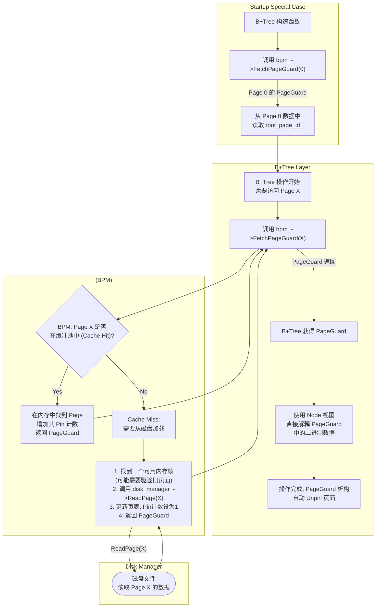

```mermaid
graph TD
subgraph B+Tree Layer
A[B+Tree 操作开始<br>需要访问 Page X] --> B["调用 bpm_->FetchPageGuard(X)"];
B -- PageGuard 返回 --> G[B+Tree 获得 PageGuard];
G --> H[使用 Node 视图<br>直接解释 PageGuard <br>中的二进制数据];
H --> I[操作完成, PageGuard 析构<br>自动 Unpin 页面];
end

    subgraph Buffer Pool Manager ["(BPM)"]
        B --> C{"BPM: Page X 是否<br>在缓冲池中 (Cache Hit)?"};
        C -- Yes --> D[在内存中找到 Page<br>增加其 Pin 计数<br>返回 PageGuard];
        C -- No --> E[Cache Miss: <br>需要从磁盘加载];
        E --> F["1. 找到一个可用内存帧<br>(可能需要驱逐旧页面)<br>2. 调用 disk_manager_->ReadPage(X)<br>3. 更新页表, Pin计数设为1<br>4. 返回 PageGuard"];
    end

    subgraph Disk Manager
        F -- "ReadPage(X)" --> DM([磁盘文件<br>读取 Page X 的数据]);
        DM --> F;
    end
    
    subgraph "Startup Special Case"
       Start[B+Tree 构造函数] --> StartB["调用 bpm_->FetchPageGuard(0)"];
       StartB -- Page 0 的 PageGuard --> StartC[从 Page 0 数据中<br>读取 root_page_id_];
       StartC --> A;
    end
    
    D --> B;
    F --> B;

```