# 并发删除流程图（两轮闩蟹 + 借用/合并 + 父键维护）

## 概述
采用两轮闩蟹（第一轮读/叶写，第二轮全写并保留路径），并在下溢时优先重分配，失败则合并，同时正确更新父分隔键与删除空页。

## 顶层时序

```mermaid
sequenceDiagram
  participant T as 线程
  participant BPT as BPlusTree
  participant BPM as BufferPoolManager
  Note over T, BPT: Remove(key, Transaction*)

  rect rgb(48, 50, 54)
    Note over BPT: 第一轮（乐观）
    T ->> BPT: root_latch_.lock_shared()
    loop 自顶向下
      BPT ->> BPM: FetchPage(root/child)
      alt 内部节点
        BPT ->> BPM: RLatch(内部) 并释放父读锁+Unpin
        BPT -->> BPT: Internal.Lookup(key)
      else 叶子节点
        BPT ->> BPM: WLatch(叶子)
        alt Is_Safe_Page(叶子, Remove)==true
          Note over BPT: 可在第一轮继续删除
        else 不安全
          Note over BPT: 释放并进入第二轮
          BPT -->> BPT: Release_W_Latches(txn) / root_latch_.unlock_shared()
          BPT -->> T: 重启第二轮
        end
      end
    end
  end

  rect rgb(48, 50, 54)
    Note over BPT: 第二轮（悲观，写锁逐层下放，保存路径）
    T ->> BPT: root_latch_.lock()
    BPT -->> BPT: txn.AddToPageSet(nullptr)
    loop 自顶向下
      BPT ->> BPM: FetchPage(child)
      BPT ->> BPM: WLatch(child)
      BPT -->> BPT: txn.AddToPageSet(page)
    end
  end

  alt 叶子存在目标键
    BPT -->> BPT: Leaf.Remove(key)
    alt 叶子下溢
      BPT -->> BPT: Handle_Underflow(leaf)
      alt 左兄弟可借
        BPT -->> BPT: Leaf.Move_Last_From(left→leaf)
        BPT -->> BPT: 更新父分隔键=leaf.first_key
      else 右兄弟可借
        BPT -->> BPT: Leaf.Move_First_From(right→leaf)
        BPT -->> BPT: 更新父分隔键=right.first_key
      else 无法借用
        alt 有左兄弟
          BPT -->> BPT: Merge(leaf→left);
          BPT -->> BPT: Parent.Remove_At(left分隔键);
          BPT -->> BPT: 标记leaf为删除
        else 有右兄弟
          BPT -->> BPT: Merge(right→leaf);
          BPT -->> BPT: Parent.Remove_At(leaf分隔键);
          BPT -->> BPT: 标记right为删除
        end
        alt 父也下溢
          BPT -->> BPT: 递归处理父下溢（Internal 借用/合并）
        end
      end
    end
  end

  BPT -->> BPT: Release_W_Latches(txn)
```

## 判定与更新要点

- 安全性判定：`Is_Safe_Page(Remove)`（根与非根阈值不同）。
- 借用后父键更新：
  - 从左借：父分隔键设为当前叶子的首键。
  - 从右借：父分隔键设为右兄弟借用后的首键。
- 合并处理：移除对应父分隔键，并维护叶链指针（`next_page_id`）。
- 根特例：根叶删空→置空树；根内仅1子→降低树高。

## 注意事项与性能

- 第二轮保留全路径写锁，保证结构修改的原子性与一致性。
- 严格遵循释放顺序与 Unpin 纪律，避免资源泄露。
- 借用优先，尽量避免频繁合并导致的上层连锁修改。
