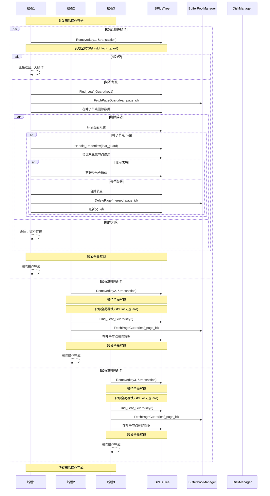
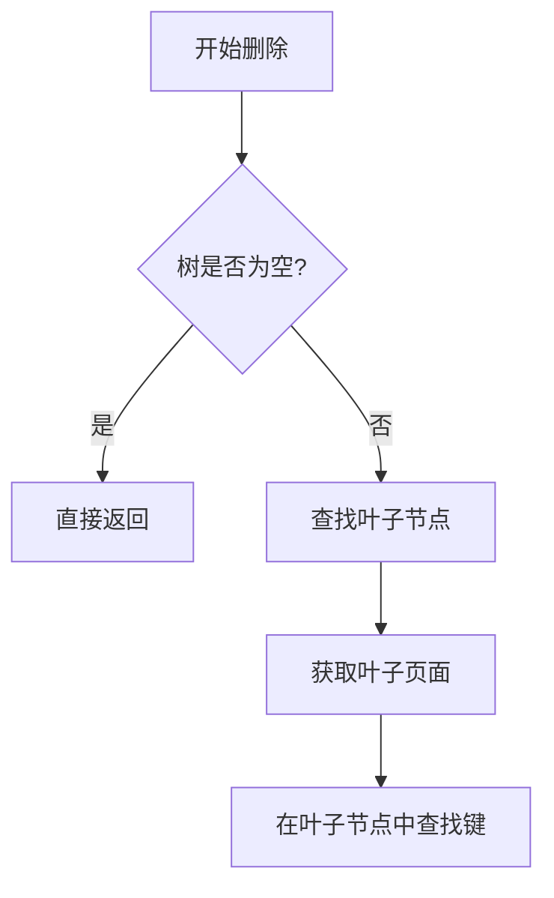
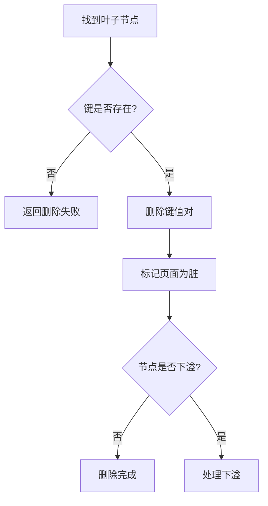
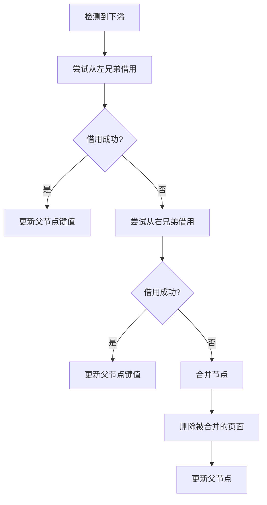

# 并发删除流程图

## 概述
本文档描述了B+树并发删除操作的执行流程，展示了多个线程同时进行删除操作时的同步机制和步骤。

## 流程图

## 关键同步机制

### 1. 全局写锁
- 使用 `std::shared_mutex root_latch_` 作为全局写锁
- 所有删除操作都需要获取独占锁 `std::lock_guard<std::shared_mutex>`
- 确保同一时间只有一个线程可以修改树结构

### 2. 页面管理
- 使用 `PageGuard` 进行自动页面管理
- 删除操作后自动标记页面为脏状态
- 页面在作用域结束时自动释放

### 3. 下溢处理
- 当叶子节点删除后元素数量不足时，触发下溢处理
- 优先尝试从兄弟节点借用元素
- 如果借用失败，则进行节点合并

## 删除操作详细流程

### 1. 查找阶段

### 2. 删除阶段

### 3. 下溢处理

## 并发安全性保证

1. **原子性**: 每个删除操作要么完全成功，要么完全失败
2. **一致性**: 通过全局锁保证树结构的一致性
3. **隔离性**: 写操作之间完全隔离，不会相互干扰
4. **持久性**: 通过缓冲池管理器确保数据最终持久化到磁盘

## 性能考虑

1. **锁粒度**: 使用全局锁可能影响并发性能
2. **页面缓存**: 利用缓冲池减少磁盘I/O
3. **合并策略**: 优先借用，避免频繁的节点合并

## 注意事项

1. 删除操作可能导致树的高度减少
2. 节点合并时需要更新父节点的键值
3. 删除空页面时需要更新磁盘管理器
4. 当前实现使用粗粒度锁，可能在高并发场景下成为性能瓶颈
