# 并发插入流程图（两轮闩蟹 + 先分裂后插入）

```mermaid
sequenceDiagram
    participant T as 线程
    participant BPT as BPlusTree
    participant BPM as BufferPoolManager
    Note over T, BPT: Insert(key, value, Transaction*)

    rect rgb(48, 50, 54)
        Note over BPT: 第一轮（乐观）
        T ->> BPT: root_latch_.lock_shared()
        loop 自顶向下
            BPT ->> BPM: FetchPage(root/child)
            alt 内部节点
                BPT ->> BPM: RLatch(内部) 并释放父的读锁+Unpin
                BPT -->> BPT: Internal.Lookup(key)
            else 叶子节点
                BPT ->> BPM: WLatch(叶子)
                alt Is_Safe_Page(叶子, Insert)==true
                    Note over BPT: 可安全直接写入
                else 不安全（将满/满）
                    Note over BPT: 释放持有的锁并进入第二轮
                    BPT -->> BPT: Release_W_Latches(txn) / root_latch_.unlock_shared()
                    BPT -->> T: 重启第二轮
                end
            end
        end
    end

    rect rgb(48, 50, 54)
        Note over BPT: 第二轮（悲观，写锁逐层下放，保存路径）
        T ->> BPT: root_latch_.lock()
        BPT -->> BPT: txn.AddToPageSet(nullptr)
        loop 自顶向下
            BPT ->> BPM: FetchPage(child);
            BPT ->> BPM: WLatch(child);
            BPT -->> BPT: txn.AddToPageSet(page)
        end
    end

alt 叶子已满或将满
Note over BPT: 先分裂再插入
BPT-->>BPT: new_leaf = NewPage() ;
BPT-->>BPT: Leaf.Split(leaf,new_leaf) ;
BPT-->>BPT: up_key = new_leaf.first_key
        loop 向上可能连锁分裂
BPT-->>BPT: 在父中插入(up_key, new_child)
alt 父未满
Note over BPT: 分裂完成
else 父满
BPT-->>BPT: new_internal = NewPage()
BPT-->>BPT: Internal.Split(parent, new_internal)
BPT-->>BPT: up_key = 分裂产生的新分隔键
BPT-->>BPT: current = parent
BPT-->>BPT: new_child = new_internal
end
end
alt key < up_key
BPT-->>BPT: Insert到左叶
else
BPT-->>BPT: Insert到右叶
end
else 叶子安全
BPT-->>BPT: Leaf.Insert(key,value)
end

BPT-->>BPT: Release_W_Latches(txn) （按路径依次解锁并Unpin）
```

## 关键同步与一致性

- 根锁：`root_latch_` 仅在寻找路径时短暂持有（第一轮 shared，第二轮 exclusive 占位）。
- 页面锁：按路径自顶向下闩蟹（第一轮 R 内部/W 叶子；第二轮全 W），并在拿到子页后释放父页锁（第一轮）。
- 路径记录：第二轮将路径写锁保存在 `Transaction::PageSet`，便于安全分裂与回溯更新父键。
- 安全检测：`Is_Safe_Page(Insert)` 决定是否需要第二轮写蟹。
- 正确性：采用“先分裂后插入”，避免在满页上写导致键值错位或越界。

## 注意事项与性能

- 两轮协议减少不必要的写锁持有时间，提高并发表现。
- 分裂只在必要时发生，父节点可能出现级联分裂。
- Insert 路径全程遵循 Unpin 纪律，避免缓冲池资源泄露。
