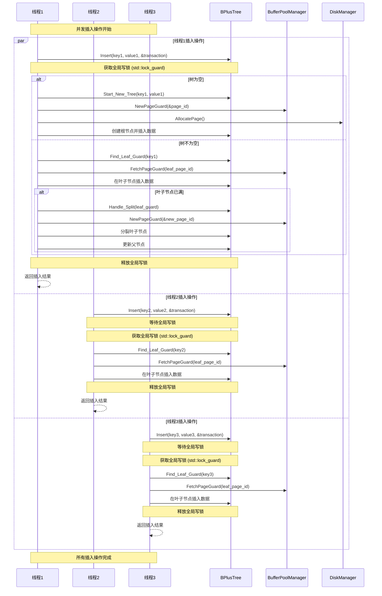

# 并发插入流程图

## 关键同步机制

### 1. 全局写锁
- 使用 `std::shared_mutex root_latch_` 作为全局写锁
- 所有插入操作都需要获取独占锁 `std::lock_guard<std::shared_mutex>`
- 确保同一时间只有一个线程可以修改树结构

### 2. 页面管理
- 使用 `PageGuard` 进行自动页面管理
- 页面在作用域结束时自动释放
- 脏页面自动标记并最终写回磁盘

### 3. 事务支持
- 虽然定义了 `Transaction` 类，但当前实现中未实际使用
- 预留了事务接口以支持未来的事务功能

## 并发安全性保证

1. **原子性**: 每个插入操作要么完全成功，要么完全失败
2. **一致性**: 通过全局锁保证树结构的一致性
3. **隔离性**: 写操作之间完全隔离，不会相互干扰
4. **持久性**: 通过缓冲池管理器确保数据最终持久化到磁盘

## 性能考虑

1. **锁粒度**: 使用全局锁可能影响并发性能
2. **页面缓存**: 利用缓冲池减少磁盘I/O
3. **批量操作**: 支持批量插入以提高效率

## 注意事项

1. 当前实现使用粗粒度锁，可能在高并发场景下成为性能瓶颈
2. 分裂操作需要更新父节点，可能涉及多个页面的修改
3. 事务参数虽然存在但未实际使用，为未来扩展预留接口
