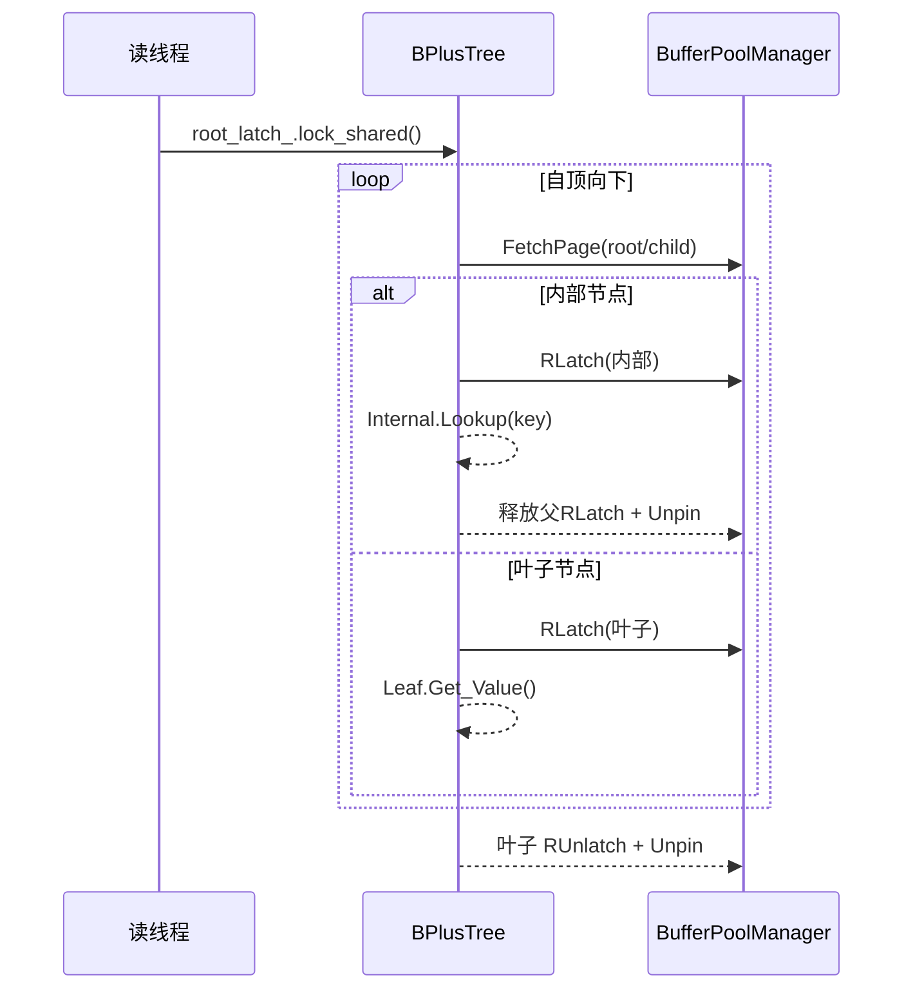
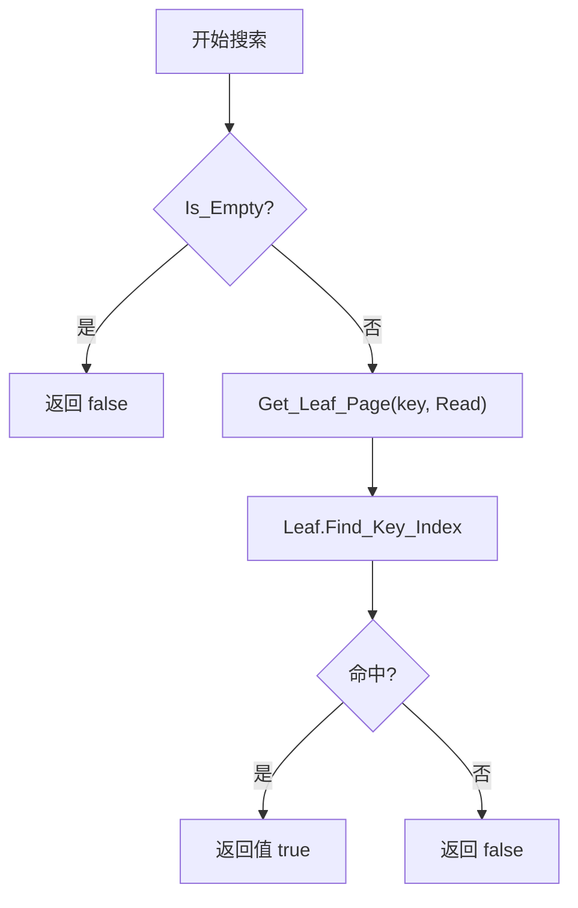

# 并发搜索流程图（读路径读锁 + 叶读锁 + Unpin 纪律）

## 概述
读操作采用共享根锁进入，沿内部节点使用读锁逐层向下，命中叶后保持叶读锁完成读取并立即释放父页，防止长链路持锁。

## 顶层时序

## 详细流程

## 同步与性能

- 根锁：进入时获取共享锁，拿到第一个子页后立即释放。
- 页锁：内部节点只在选择子页期间短持读锁，叶子持读锁直至完成读取。
- 资源管理：所有读取页在解锁后立刻 Unpin，避免 Pin 泄漏（实现已在 `Get_Value` 中补充 Unpin）。