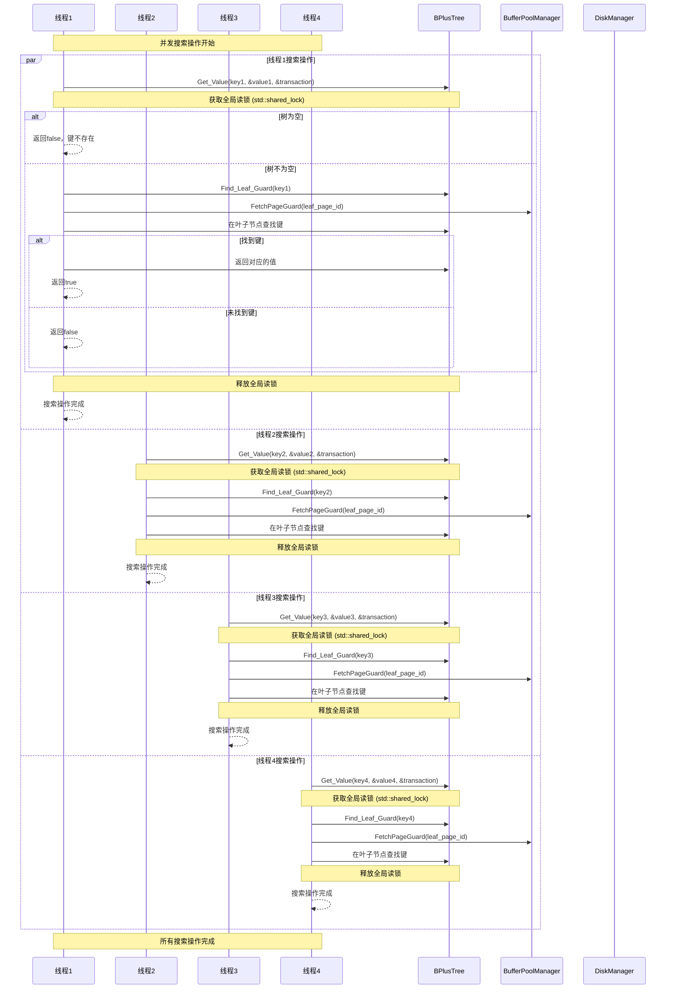
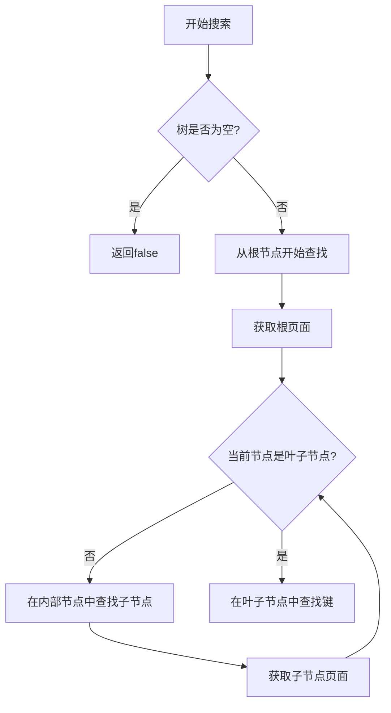
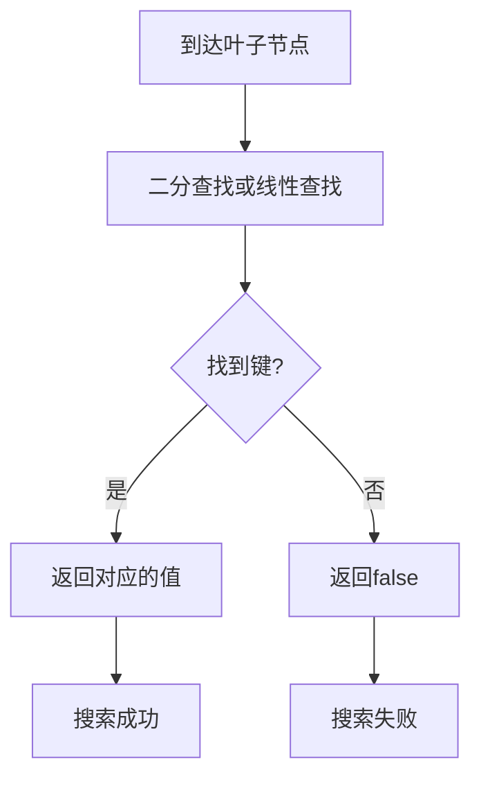
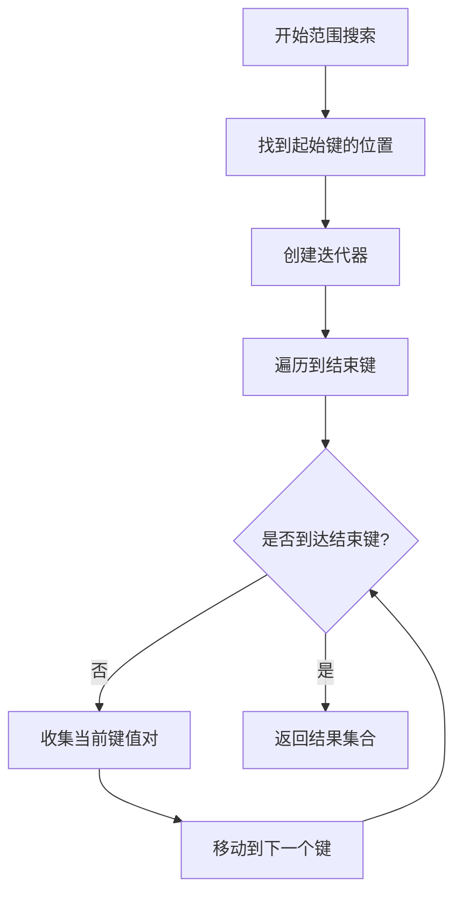
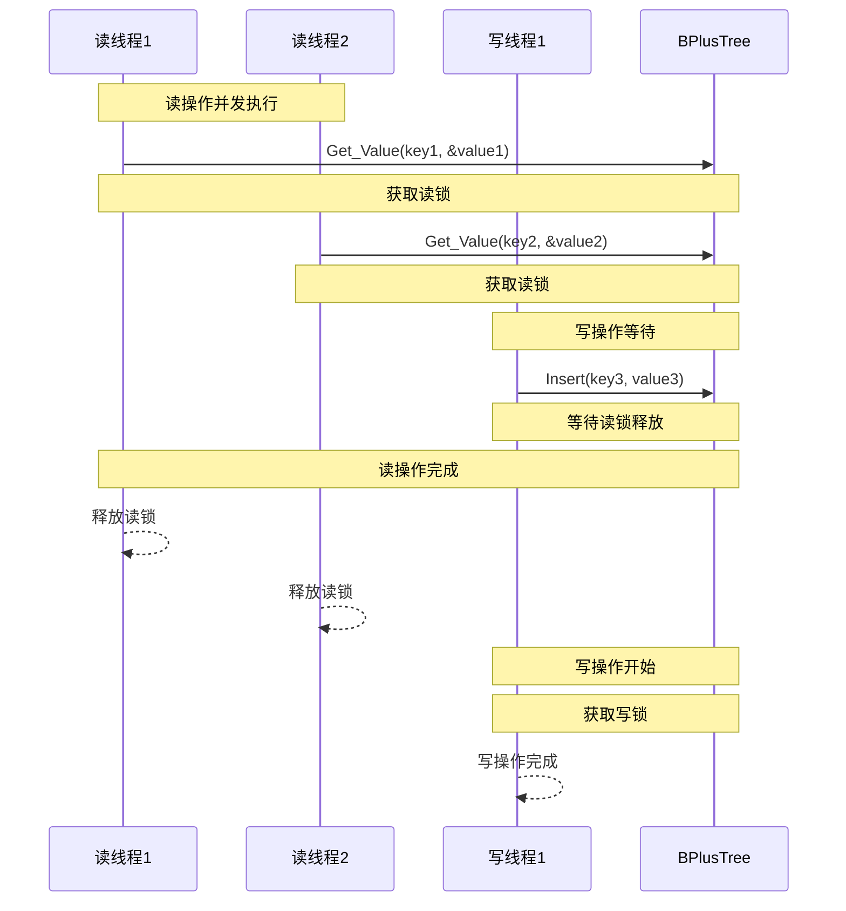

# 并发搜索流程图

## 概述
本文档描述了B+树并发搜索操作的执行流程，展示了多个线程同时进行搜索操作时的同步机制和步骤。

## 流程图

## 关键同步机制

### 1. 全局读锁
- 使用 `std::shared_mutex root_latch_` 作为全局读写锁
- 所有搜索操作都获取共享读锁 `std::shared_lock<std::shared_mutex>`
- 多个读操作可以并发执行，但写操作需要等待所有读操作完成

### 2. 页面管理
- 使用 `PageGuard` 进行自动页面管理
- 搜索操作不会修改页面内容，不需要标记为脏
- 页面在作用域结束时自动释放

### 3. 并发读优化
- 多个读操作可以同时进行，提高并发性能
- 读操作不会阻塞其他读操作
- 只有写操作会阻塞读操作

## 搜索操作详细流程

### 1. 查找阶段

### 2. 叶子节点查找

### 3. 范围搜索

## 并发安全性保证

1. **原子性**: 每个搜索操作要么完全成功，要么完全失败
2. **一致性**: 通过读锁保证读取数据的一致性
3. **隔离性**: 读操作之间可以并发执行，不会相互干扰
4. **持久性**: 搜索操作不涉及数据修改，不需要持久化

## 性能考虑

1. **读锁并发**: 多个读操作可以同时进行，提高并发性能
2. **页面缓存**: 利用缓冲池减少磁盘I/O
3. **查找优化**: 使用二分查找提高查找效率

## 读写冲突处理

## 注意事项

1. 读操作不会修改树结构，因此可以安全并发
2. 写操作会阻塞所有读操作，确保数据一致性
3. 当前实现使用全局锁，可能在高并发场景下影响性能
4. 范围搜索需要遍历多个页面，可能需要更长的锁持有时间
