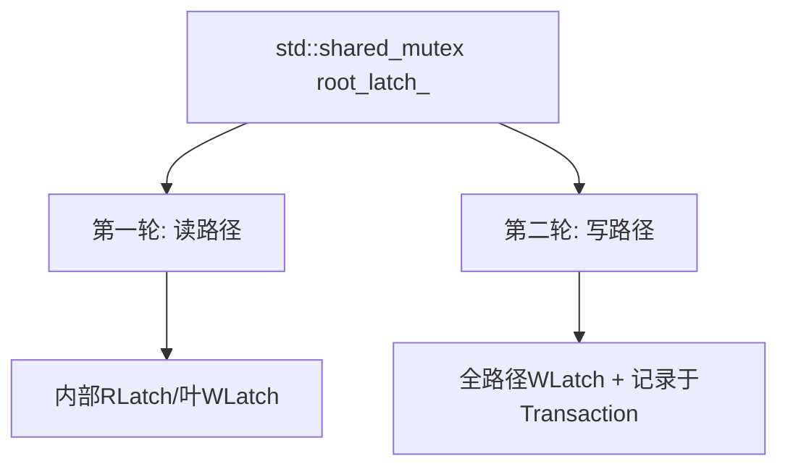
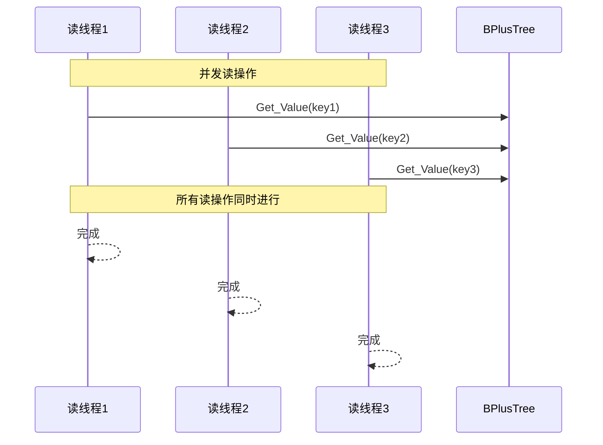
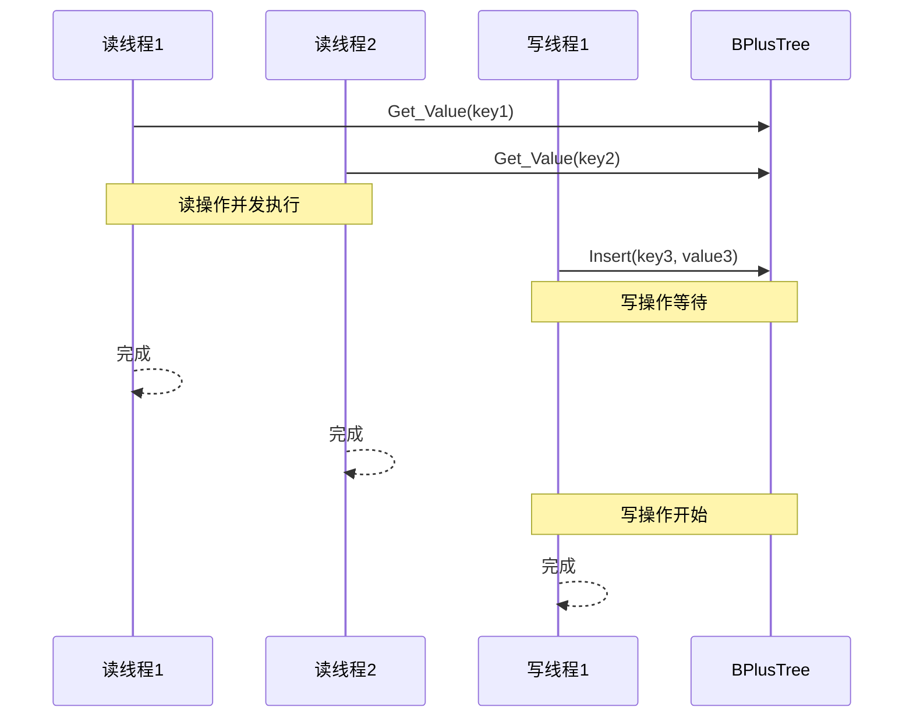
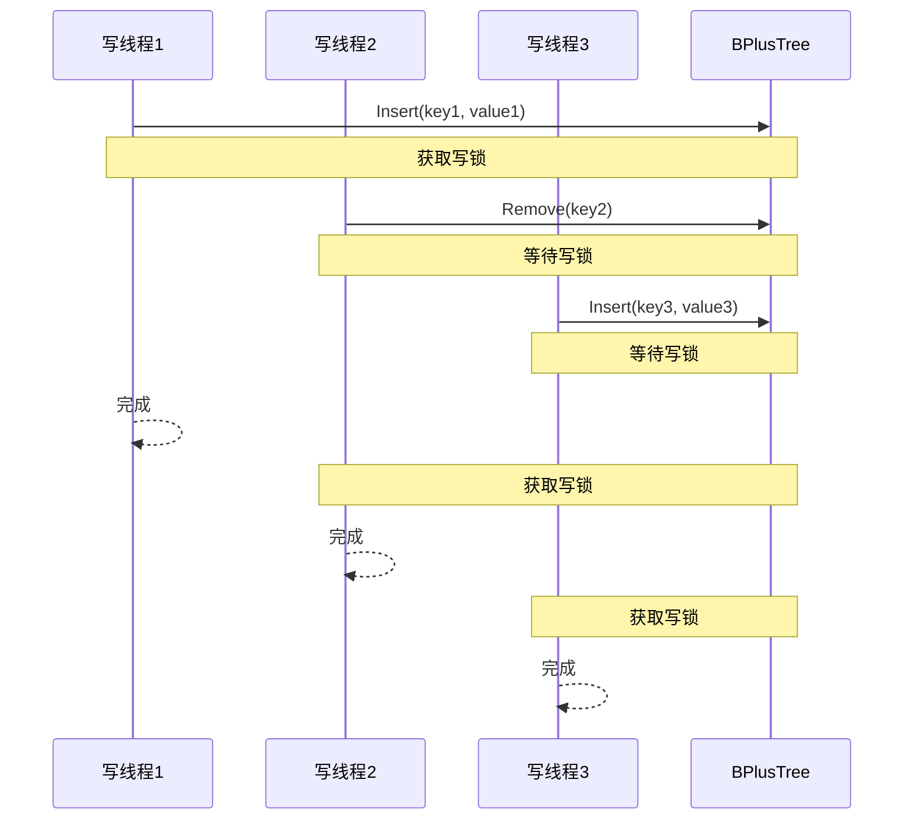
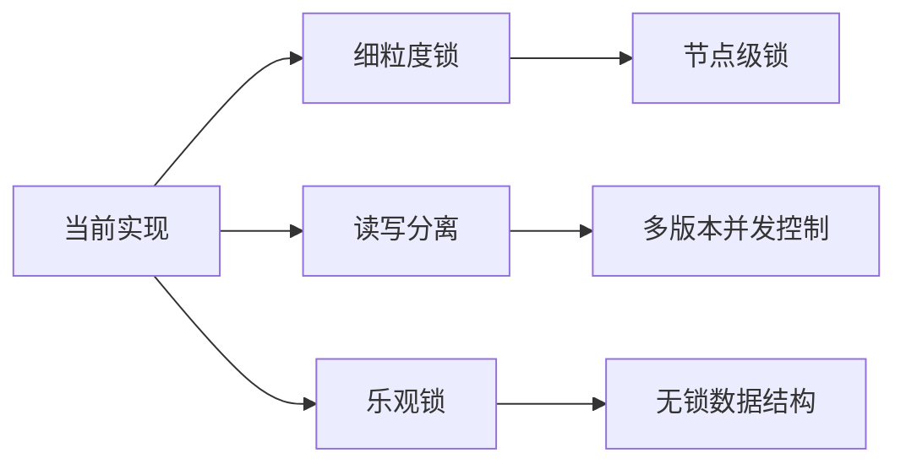
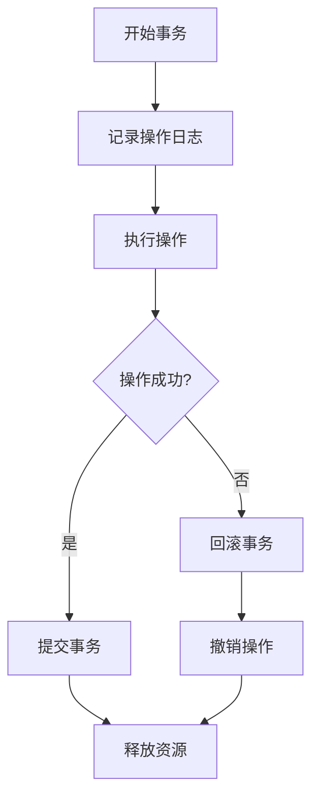

# B+树并发操作总览

## 概述
本文档总结了B+树中三种主要并发操作的执行机制、同步策略和性能特点。

## 并发操作类型对比

| 操作类型 | 锁类型 | 并发性 | 主要特点 | 性能影响 |
|---------|--------|--------|----------|----------|
| **插入** | 两轮协议：第一轮R/叶W，第二轮路径W | 写间串行（第二轮） | 先分裂后插入，父可能级联分裂 | 中等 |
| **删除** | 两轮协议：第一轮R/叶W，第二轮路径W | 写间串行（第二轮） | 借用优先，失败则合并并更新父键 | 中等 |
| **搜索** | 根/内部/叶读锁（短持） | 高并发 | 即时释放父页，叶命中后返回 | 高 |

## 同步机制总结

### 1. 锁策略


### 2. 操作优先级
- **读操作**: 可以并发执行，优先级较高
- **写操作**: 需要独占访问，优先级较低
- **读写冲突**: 写操作等待所有读操作完成

## 并发场景分析

### 1. 纯读场景


**特点**: 最佳性能，无阻塞

### 2. 读写混合场景


**特点**: 写操作会阻塞后续读操作

### 3. 纯写场景


**特点**: 完全串行，性能最低

## 性能优化建议

### 1. 当前实现的局限性
- **粗粒度锁**: 使用全局锁限制了并发性能
- **写操作阻塞**: 写操作会阻塞所有读操作
- **锁竞争**: 高并发场景下可能出现锁竞争

### 2. 改进方向


### 3. 具体优化策略

#### 3.1 细粒度锁
- 为每个节点维护独立的锁
- 减少锁竞争，提高并发性
- 实现复杂度较高

#### 3.2 读写分离
- 使用多版本并发控制(MVCC)
- 读操作不阻塞写操作
- 需要额外的版本管理开销

#### 3.3 乐观锁
- 假设冲突较少，先执行后检查
- 冲突时回滚重试
- 适合读多写少的场景

## 事务支持现状

### 1. Transaction类定义
```cpp
class Transaction {
public:
    Transaction() = default;
    auto GetPageSet() -> std::deque<Page *> & { return page_set_; }
    void AddToPageSet(Page *page) { page_set_.push_back(page); }
private:
    std::deque<Page *> page_set_;
};
```

### 2. 当前状态
- **接口预留**: 所有操作都接受Transaction参数
- **未实际使用**: Transaction对象在操作中未被使用
- **未来扩展**: 为事务功能预留了接口

### 3. 事务功能实现建议


## 测试验证

### 1. 并发测试场景
- **并发插入测试**: 验证多个线程同时插入数据
- **并发删除测试**: 验证多个线程同时删除数据
- **并发搜索测试**: 验证多个线程同时搜索数据
- **混合操作测试**: 验证读写混合场景

### 2. 性能指标
- **吞吐量**: 单位时间内完成的操作数
- **延迟**: 单个操作的平均响应时间
- **并发度**: 同时执行的操作数
- **资源利用率**: CPU和内存使用情况

## 总结

当前B+树实现提供了基本的并发安全性，但存在以下特点：

1. **安全性**: 通过全局锁保证了数据一致性
2. **简单性**: 实现相对简单，易于理解和维护
3. **局限性**: 并发性能受全局锁限制
4. **扩展性**: 预留了事务接口，便于未来扩展

对于高并发场景，建议考虑实现更细粒度的锁机制或多版本并发控制。
