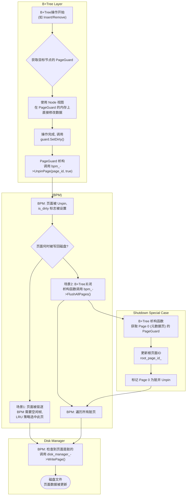

```mermaid
graph TD
subgraph B+Tree Layer
A["B+Tree操作开始<br>(如 Insert/Remove)"] --> B{获取目标节点的 PageGuard};
B --> C[使用 Node 视图<br>在 PageGuard 的内存上<br>直接修改数据];
C --> D["操作完成, 调用<br>guard.SetDirty()"];
D --> E["PageGuard 析构<br>调用 bpm_->UnpinPage(page_id, true)"];
end

    subgraph Buffer Pool Manager ["(BPM)"]
        E --> F[BPM: 页面被 Unpin,<br>is_dirty 标志被设置];
        F --> G{页面何时被写回磁盘?};
        G --> H[场景1: 页面被驱逐<br>BPM 需要空闲帧, <br>LRU 策略选中此页];
        G --> I["场景2: B+Tree关闭<br>析构函数调用 bpm_->FlushAllPages()"];
        I --> J[BPM: 遍历所有脏页];
    end

    subgraph Disk Manager
        H --> K["BPM: 检查到页面是脏的<br>调用 disk_manager_->WritePage()"];
        J --> K;
        K --> L([磁盘文件<br>页面数据被更新]);
    end
    
    subgraph "Shutdown Special Case"
        I --> M["B+Tree 析构函数<br>获取 Page 0 (元数据页) 的 PageGuard"];
        M --> N[更新根页面ID<br>root_page_id_];
        N --> O[标记 Page 0 为脏并 Unpin];
        O --> J;
    end

%%    style A fill:#cde4ff
%%    style L fill:#cde4ff
```