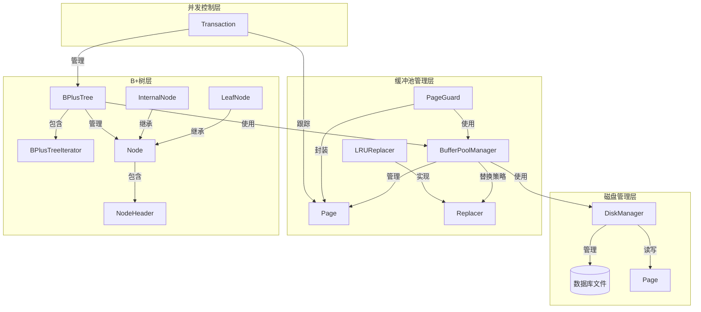
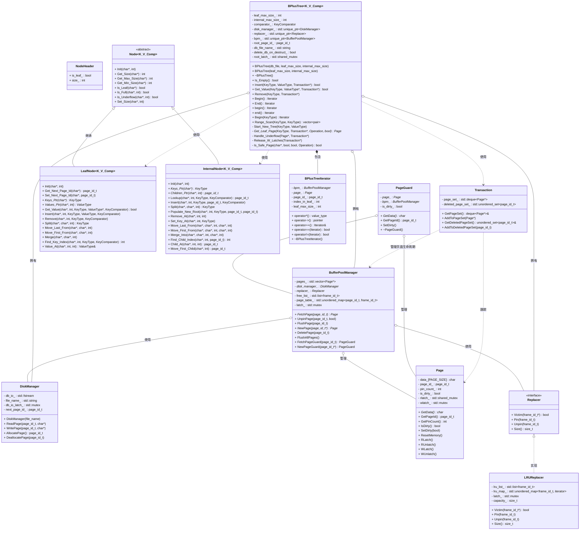

# B+树并发数据库系统类图

## 系统架构图

## 详细类图

## 关键设计特点

### 1. 并发控制机制
- **根锁**: `std::shared_mutex root_latch_` 保护根页面ID访问
- **页面锁**: 每个Page包含读写锁(`rlatch_`, `wlatch_`)
- **两轮闩蟹**: 第一轮乐观读/叶写，第二轮悲观全路径写锁
- **事务管理**: Transaction跟踪锁定的页面和待删除页面

### 2. 内存管理
- **RAII模式**: PageGuard自动管理页面生命周期
- **引用计数**: Page的pin_count_跟踪使用情况
- **LRU替换**: 缓冲池使用LRU策略管理页面

### 3. 节点设计
- **页面视图**: Node类不拥有数据，而是解释Page的数据区
- **布局优化**: NodeHeader + Keys + Values/Children的紧凑布局
- **类型安全**: 模板化设计支持任意键值类型

### 4. 迭代器支持
- **STL兼容**: 实现标准迭代器接口
- **自动清理**: 析构时自动释放页面锁和Pin
- **范围查询**: 支持范围扫描和单键查找

### 5. 性能优化
- **时间统计**: 全局时间统计支持性能分析
- **批量操作**: 支持批量插入和删除
- **缓存友好**: 页面级缓存减少磁盘I/O