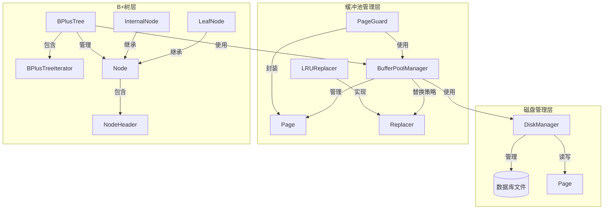
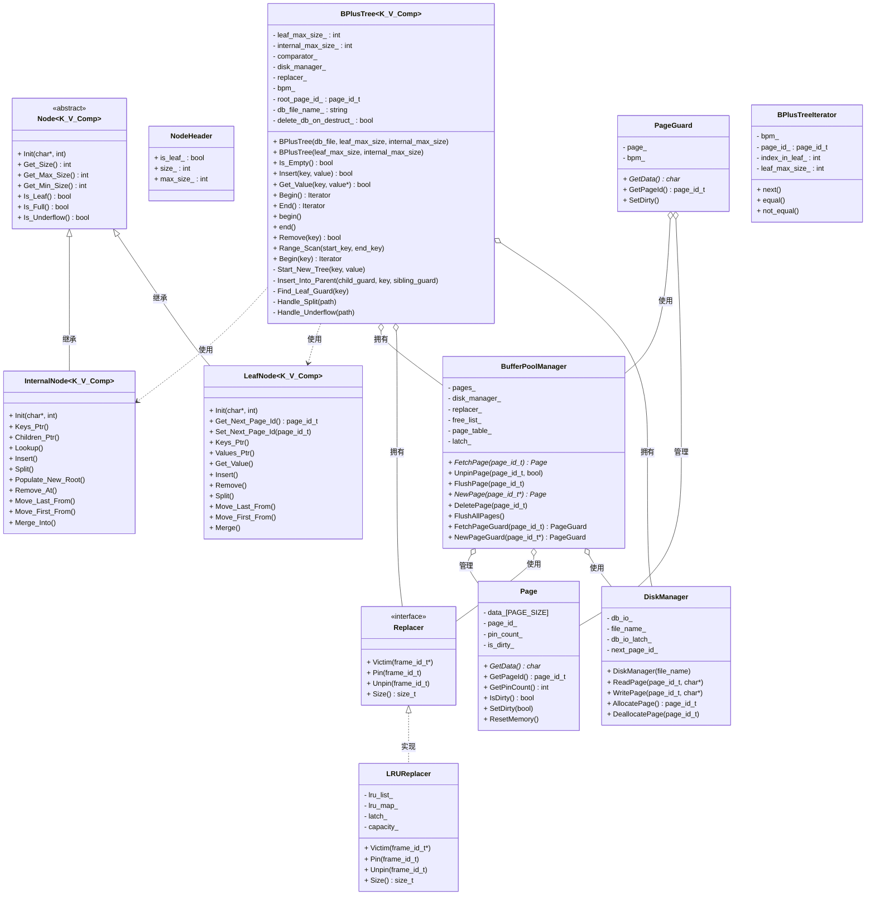

```mermaid
graph TD
    subgraph 磁盘管理层
        DM[DiskManager] -- 管理 --> File[(数据库文件)]
        DM -- 读写 --> P1[Page]
    end

    subgraph 缓冲池管理层
        BPM[BufferPoolManager] -- 管理 --> P2[Page]
        BPM -- 替换策略 --> Replacer
        BPM -- 使用 --> DM
        LRUReplacer -- 实现 --> Replacer
        Guard[PageGuard] -- 封装 --> P2
        Guard -- 使用 --> BPM
    end

    subgraph B+树层
        BPT["BPlusTree<K,V,Comp>"]
        Iter["BPlusTreeIterator"]
        N["Node<K,V,Comp>"] -- 包含 --> NH["NodeHeader"]
        Leaf["LeafNode<K,V,Comp>"] -- 继承 --> N
        Internal["InternalNode<K,V,Comp>"] -- 继承 --> N
        BPT -- 使用 --> BPM
        BPT -- 包含 --> Iter
        BPT -- 管理 --> N
    end

%%    classDef default fill:#1f2020,stroke:#333,stroke-width:2px;


```

```mermaid

classDiagram

%% --- 基础设施 ---

class DiskManager {
    - db_io_
    - file_name_
    - db_io_latch_
    - next_page_id_
    + DiskManager(file_name)
    + ReadPage(page_id_t, char*)
    + WritePage(page_id_t, char*)
    + AllocatePage() page_id_t
    + DeallocatePage(page_id_t)
}

class Page {
    - data_[PAGE_SIZE]
    - page_id_
    - pin_count_
    - is_dirty_
    + GetData() char*
    + GetPageId() page_id_t
    + GetPinCount() int
    + IsDirty() bool
    + SetDirty(bool)
    + ResetMemory()
}

class PageGuard {
    - page_
    - bpm_
    + GetData() char*
    + GetPageId() page_id_t
    + SetDirty()
}

class Replacer {
    <<interface>>
    + Victim(frame_id_t*)
    + Pin(frame_id_t)
    + Unpin(frame_id_t)
    + Size() size_t
}

class LRUReplacer {
    - lru_list_
    - lru_map_
    - latch_
    - capacity_
    + Victim(frame_id_t*)
    + Pin(frame_id_t)
    + Unpin(frame_id_t)
    + Size() size_t
}

class BufferPoolManager {
    - pages_
    - disk_manager_
    - replacer_
    - free_list_
    - page_table_
    - latch_
    + FetchPage(page_id_t) Page*
    + UnpinPage(page_id_t, bool)
    + FlushPage(page_id_t)
    + NewPage(page_id_t*) Page*
    + DeletePage(page_id_t)
    + FlushAllPages()
    + FetchPageGuard(page_id_t) PageGuard
    + NewPageGuard(page_id_t*) PageGuard
}

%% --- B+树 ---

class NodeHeader {
    + is_leaf_ : bool
    + size_ : int
    + max_size_ : int
}

class Node~K_V_Comp~ {
    <<abstract>>
    + Init(char*, int)
    + Get_Size() int
    + Get_Max_Size() int
    + Get_Min_Size() int
    + Is_Leaf() bool
    + Is_Full() bool
    + Is_Underflow() bool
}

class LeafNode~K_V_Comp~ {
    + Init(char*, int)
    + Get_Next_Page_Id() page_id_t
    + Set_Next_Page_Id(page_id_t)
    + Keys_Ptr()
    + Values_Ptr()
    + Get_Value()
    + Insert()
    + Remove()
    + Split()
    + Move_Last_From()
    + Move_First_From()
    + Merge()
}

class InternalNode~K_V_Comp~ {
    + Init(char*, int)
    + Keys_Ptr()
    + Children_Ptr()
    + Lookup()
    + Insert()
    + Split()
    + Populate_New_Root()
    + Remove_At()
    + Move_Last_From()
    + Move_First_From()
    + Merge_Into()
}

class BPlusTree~K_V_Comp~ {
    - leaf_max_size_ : int
    - internal_max_size_ : int
    - comparator_
    - disk_manager_
    - replacer_
    - bpm_
    - root_page_id_ : page_id_t
    - db_file_name_ : string
    - delete_db_on_destruct_ : bool
    + BPlusTree(db_file, leaf_max_size, internal_max_size)
    + BPlusTree(leaf_max_size, internal_max_size)
    + Is_Empty() bool
    + Insert(key, value) bool
    + Get_Value(key, value*) bool
    + Begin() Iterator
    + End() Iterator
    + begin()
    + end()
    + Remove(key) bool
    + Range_Scan(start_key, end_key)
    + Begin(key) Iterator
    - Start_New_Tree(key, value)
    - Insert_Into_Parent(child_guard, key, sibling_guard)
    - Find_Leaf_Guard(key)
    - Handle_Split(path)
    - Handle_Underflow(path)
}

class BPlusTreeIterator {
    - bpm_
    - page_id_ : page_id_t
    - index_in_leaf_ : int
    - leaf_max_size_ : int
    + next()
    + equal()
    + not_equal()
}

%% --- 关系 ---
Replacer <|.. LRUReplacer : 实现
BufferPoolManager o-- DiskManager : 使用
BufferPoolManager o-- Replacer : 使用
BufferPoolManager o-- Page : 管理
PageGuard o-- Page : 管理
PageGuard o-- BufferPoolManager : 使用
Node~K_V_Comp~ <|-- LeafNode~K_V_Comp~ : 继承
Node~K_V_Comp~ <|-- InternalNode~K_V_Comp~ : 继承
BPlusTree~K_V_Comp~ o-- DiskManager : 拥有
BPlusTree~K_V_Comp~ o-- Replacer : 拥有
BPlusTree~K_V_Comp~ o-- BufferPoolManager : 拥有
BPlusTree~K_V_Comp~ ..> LeafNode~K_V_Comp~ : 使用
BPlusTree~K_V_Comp~ ..> InternalNode~K_V_Comp~ : 使用


```